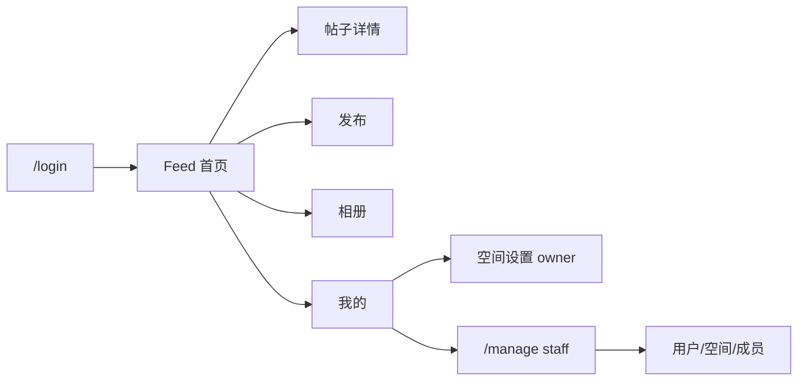

# 文档 11：双端产品信息架构（IA）

本文是**用户端 Blog / 朋友圈**与**管理端 Console**的页面与导航真源。实现时以本文 + [05-roadmap](./05-roadmap.md) 阶段 U1–U5 为准；与旧「单壳 CRUD」冲突时，以本文为准。

关联：[01-srs](./01-srs.md)（双端形态与用户故事）、[10-frontend-theme](./10-frontend-theme.md)（视觉 token）。

---

## 11.1 已定产品决策

| 决策 | 结论 |
| :--- | :--- |
| 默认首页 | 用户端 **动态 Feed**（朋友圈时间流） |
| Owner 成员治理 | 用户端 **`/settings/workspace`** |
| Staff 全局治理 | 仅 **`/manage/*`**，独立壳 |
| Feed 分组（一期） | 按 **`created_at` 自然日** |
| 业务日 `record_date` | **U3** 再引入（日历 / 一天一张） |
| 「一天一张」 | **软提示**，不硬限制 |
| 登录落地 | `/login` 成功后进入 **Feed**，不进管理台 |
| 媒体库 / 相册 | 「全部照片」汇总动态与直传图；可自建 `Album` 管理 |

---

## 11.2 双端总览

```
┌──────────────────────────────┐     ┌──────────────────────────────┐
│  用户端（Blog / 朋友圈）         │     │  管理端（Console）               │
│  登录后默认 · 按 Workspace 浏览  │     │  staff · 独立壳与导航             │
│  主路径：刷动态 → 详情 → 评论    │     │  主路径：用户 / 空间 / 成员         │
│  壳：UserShell + 顶栏 Nav（手机汉堡菜单） │     │  壳：ManageShell + 侧栏         │
└──────────────────────────────┘     └──────────────────────────────┘
         │ 共用 JWT + Workspace / Record / Media / Comment API
```



---

## 11.3 用户端

### 11.3.1 顶栏 Nav

桌面：顶栏横排链接。手机：右上角汉堡按钮弹出侧滑菜单。

| 项 | 路由 | 说明 |
| :--- | :--- | :--- |
| 动态 | `/` 或 `/feed` | 默认；朋友圈流 |
| 相册 | `/album` | 相册列表（全部照片 + 自建相册） |
| 全部照片 | `/album/all` | 空间内图片汇总，全屏浏览 |
| 相册详情 | `/album/:id` | 相册内容与管理 |
| 家族 | `/family` | 只读径向图谱（展示） |
| 发布 | `/compose` | viewer 隐藏 |
| 我的 / 账号 | `/me` | 全局资料（头像/用户名/介绍）；空间关系只读；**不含** Workspace 切换 |
| 选择空间 | `/spaces` | 登录后入口；卡片选宝宝；**不可自助创建**（由管理员创建并分配） |
| 创建空间 | `/spaces/new` | 重定向到管理台（仅 staff 可用） |

**U3** 再增加「日历」导航项。

### 11.3.2 页面地图

| 路由 | 页面 | 权限要点 | 实现来源（现状 → 目标） |
| :--- | :--- | :--- | :--- |
| `/login` | 登录 | 公开 | [`LoginPage`](../frontend/src/features/auth/LoginPage.tsx)；成功后 → Feed |
| `/spaces` | 选空间 | 已登录 | 干净卡片：封面 / 宝宝名 / 年龄 / Latest Memory；无自助创建 |
| `/spaces/new` | （兼容） | staff | 跳转 `/manage/workspaces` |
| `/` 或 `/feed` | 动态 Feed | 成员可读 | **新建**；`GET .../records/` 按日分组卡片化 |
| `/records/:id` | 帖子详情 | 成员可读；改删按角色 | [`RecordDetailPage`](../frontend/src/features/records/RecordDetailPage.tsx) → 阅读向 UI |
| `/compose` | 发布（朋友圈式：想法 + 九宫格，无标题栏） | owner / editor | [`RecordFormPage`](../frontend/src/features/records/RecordFormPage.tsx) 模式 create |
| `/records/:id/edit` | 编辑 | 分级权限同现有 | RecordFormPage 模式 edit |
| `/album` | 相册 | 成员可读 | [`MediaLibraryPage`](../frontend/src/features/media/MediaLibraryPage.tsx) 改路径/文案 |
| `/family` | 家族图谱 | 成员只读浏览 | 全屏径向展示；编辑入口在 `/me` |
| `/me` | 我的 | 已登录；本人改显示名/简介；owner/editor 可补 peer 关系 | Workspace 切换 + 本空间资料 |
| `/settings/workspace` | 空间设置 | **owner** | [`MembersPanel`](../frontend/src/features/workspaces/MembersPanel.tsx)；邀请须选「相对谁」 |

### 11.3.3 Feed 行为（一期）

- 数据：现有分页 `GET /api/workspaces/{id}/records/`（含嵌套 `media`）。
- UI：按 `created_at` 的日历日分组（如「今天」「昨天」「2026-09-15」）。
- 卡片：作者 `relation_label`、时间、正文摘要、图/视频九宫格、音频条、评论入口。
- 交互：点卡片 → 详情；点图可进大图/照片评论（沿用现逻辑）。
- viewer：无「发布」；**可评论**（本空间成员均可）。

### 11.3.4 壳层

- **`UserShell`**：顶栏（品牌 + 宝宝 + 导航）；手机汉堡弹出侧滑菜单；**不含** staff 管理主入口。
- 由现 [`AppShell`](../frontend/src/components/AppShell.tsx) / [`TopBar`](../frontend/src/components/TopBar.tsx) 拆分演化。
- 旧首页 [`HomePage`](../frontend/src/features/auth/HomePage.tsx)（欢迎语 + 成员面板）**不再作为默认落地页**；成员能力迁到空间设置。

---

## 11.4 管理端

### 11.4.1 谁进入

| 角色 | 入口 | 能力 |
| :--- | :--- | :--- |
| staff | `/me` →「打开管理台」或直达 `/manage` | 全局用户、Workspace、跨空间 Membership |
| owner | **不进** staff 管理台办日常事 | 仅用 `/settings/workspace` |
| editor / viewer | 无管理台 | — |

未登录访问 `/manage/*` → `/login?next=/manage`。非 staff → 拒绝（现有 `RequireStaff`）。

### 11.4.2 页面地图

| 路由 | 页面 | 实现来源 |
| :--- | :--- | :--- |
| `/manage` | 概览（简） | 新；或重定向到 users |
| `/manage/users` | 用户 CRUD | 拆自 [`ManagePage`](../frontend/src/features/manage/ManagePage.tsx) |
| `/manage/workspaces` | 工作区 | 同上 |
| `/manage/memberships` | 跨空间成员分配 | 同上 |

### 11.4.3 壳层

- **`ManageShell`**：侧栏导航 +「返回用户端」→ Feed。
- **禁止**复用朋友圈底栏；视觉可与用户端同 token，但布局为后台型。

---

## 11.5 路由与组件对照（迁移清单）

| 现状 | 目标 |
| :--- | :--- |
| `/` HomePage | → `/feed`；Home 逻辑拆散 |
| `/records` 列表 | → Feed 替代主列表；可 301/重定向到 `/feed` |
| `/records/:id` | 保留路径（或别名 `/posts/:id`，实现时二选一，默认保留 records） |
| `/records/new` | → `/compose`（兼容重定向） |
| `/media` | → `/album`（兼容重定向） |
| `/manage` 单页 | → `/manage/*` 多页 + ManageShell |
| TopBar「管理」常驻 | → 仅 `/me` 对 staff 展示 |

前端路由入口：[`frontend/src/routes/AppRoutes.tsx`](../frontend/src/routes/AppRoutes.tsx)。

---

## 11.6 后端影响（文档约定）

| 阶段 | API / 模型 |
| :--- | :--- |
| U1–U2 | **不改**模型；Feed 复用 records 列表 |
| U3 | 可选 `GrowthRecord.record_date`；日历聚合；软提示「今日尚未发图」 |
| U4 | 管理 API 已有，主要前端拆页 |
| 上线 | 见 roadmap 阶段 7（原体验与部署） |

---

## 11.7 成功标准（IA 层面）

1. 家人登录后第一屏是 **刷动态**，无「管理 / 成员表」主视觉。
2. Owner 在用户端完成邀请与改称呼；staff 在另一套壳完成全局配置。
3. 相册、发布、我的可通过底栏到达；路径与上表一致或可重定向。
4. 文档与实现冲突时，先更新本文与 roadmap，再改代码。
